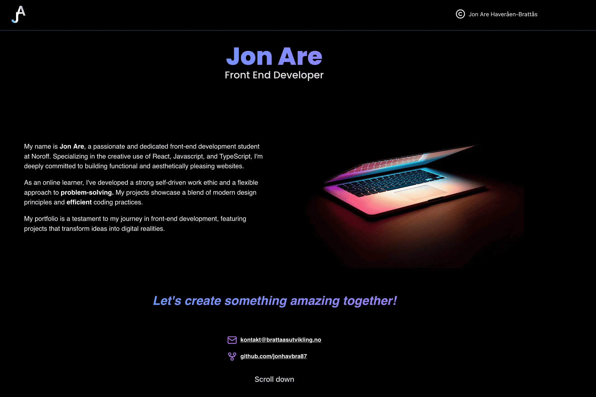

# Portfolio 2



## 🎯 **Project Goal**

The goal for this project is to showcase my work as a Front End Developer at Noroff.

## 📝 **Project Brief**

This portfolio showcases my frontend development skills and projects created during my studies at Noroff School of Technology. It features three key projects that demonstrate my progression and capabilities as a developer.

## 🖥️ **Live Demo**

[Link to live demo](https://portfolio-jahb.netlify.app/)

---

## 🔧 **Features**

### Project Exam 2: Holidaze

A comprehensive accommodation booking platform that allows users to browse venues, make bookings, and venue managers to create and manage their listings.

## 🚀 **Technologies Used**

- **REACT** and **TypeScript** for the front-end development.
- **Tailwind** for responsive design and UI components.
- **Yup** & **React-Hook-Form** for validation.
- **Zustand** for storing login & registration information.
- **Vite** as the build tool and development server for fast module-based development.
- **API**: The site interacts with the [Noroff Holidaze API](https://docs.noroff.dev/docs/v2/holidaze/bookings) to manage items data.

### Semester Project 2
The objective of this project is to apply the front-end development skills acquired over the past three semesters by building an auction website. The website will allow users to bid on items, as well as create and manage their own listings.

- **HTML5**, **SCSS**, and **JavaScript** for the front-end development.
- **Bootstrap** for responsive design and UI components.
- **Vite** as the build tool and development server for fast module-based development.
- **Figma** for design and prototyping
- **API**: The site interacts with the [Noroff Auction API](hhttps://docs.noroff.dev/docs/v2/auction-house/listings) to manage listing data and bids.
- **Jest** for unit testing.

### Javascript Frameworks CA
To apply knowledge of JavaScript techniques to implement the front-end functionality for a social media application.

- **HTML**, **CSS** & **JavaScript** for the front-end development.
- **Bootstrap** for responsive design and UI components.
- **HTML** & **Regex** for validation.
- **LocalStorage** for storing login & registration information.
- **API**: The site interacts with the [Noroff Social API](https://docs.noroff.dev/docs/v1/social/authentication) to manage items data.

---

## 🛠️ **Setup Instructions**

1. Clone the repo:

```bash
git clone https://github.com/jonhavbra87/portfolio2-ca
```

2. Install the dependencies:

```
npm install
```

### Running

Run the app:

```
npm run dev
```

### Bagdes

[](https://app.netlify.com/sites/portfolio-jahb/deploys)

## Contributing

This is a Noroff Courtse Assignemt for my portfolio. I appreciate a peer review if you got the time!

## Contact

<p align="start">
  <a href="https://no.linkedin.com/in/jon-are-haver%C3%A5en-bratt%C3%A5s-5a3805262?trk=people-guest_people_search-card">
     
  </a>
  <a href="https://www.discord.com">
     
  </a>
  <a href="https://www.instagram.com/jonareb87?igsh=MTAwdDEzZHFwMWFjbQ%3D%3D&utm_source=qr">
     
  </a>
  <a href="mailto:kontakt@brattaasutvikling.no">
     
  </a>
</p>

## License

All work in this repository is licensed under the [Creative Commons Attribution-ShareAlike 4.0 International License](https://creativecommons.org/licenses/by-sa/4.0/).
